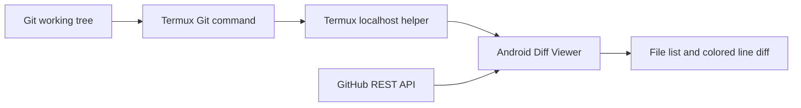
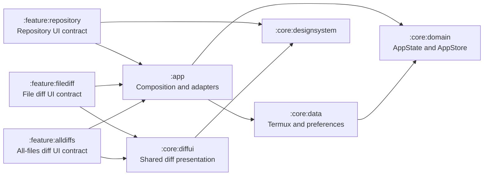

# Diff Viewer product overview

## Purpose

Diff Viewer is an Android application for reviewing Git working-tree changes made in Termux, including changes
made by Codex, and commit changes obtained directly from public or authorized private GitHub repositories.

The Termux terminal can display `git diff`, but a large diff eventually exceeds the useful terminal scrollback.
This application provides a persistent, touch-friendly view in which the complete diff remains available for
navigation and review.

## Product goal

Let the user open this Android application after files change in a Termux project and inspect the same underlying
Git changes without depending on terminal scrollback.

The application must make the meaning of each line immediately visible:

- Deleted lines have a `-` prefix, subdued text, and a light red background.
- Added lines have a `+` prefix and a light green background.
- Unchanged context lines use neutral styling.
- Large diffs remain scrollable from beginning to end.

This is initially a review tool. It does not edit source files, stage changes, create commits, or resolve merge
conflicts.

## Agreed architecture

Termux remains responsible for Git operations. A small helper process running in Termux invokes Git for an
explicitly allowed repository and returns structured diff data through a localhost-only interface. The Android
application requests that data and renders it.



The local-helper path is preferred over implementing Git inside the Android application because it preserves Git
CLI behavior, avoids parsing `.git` internals, and makes staged, unstaged, renamed, and binary changes easier to
represent consistently. The direct GitHub path supplements it for committed remote history; it does not replace
the helper for working-tree data.

### Repository data sources

The repository screen offers two read-only data sources:

- **Termux:** connects to the localhost helper and displays the working tree, latest commit, and first-parent
  commit history.
- **GitHub:** accepts a `https://github.com/owner/repository` URL and reads the default branch's commits directly
  through the GitHub REST API. Public repositories work without a token. Private repositories require a
  fine-grained personal access token that is authorized for that repository with read-only **Metadata** and
  **Contents** permissions.

The selected source and both sources' connection values are stored in private application preferences. Switching
sources does not discard the other source's saved values. GitHub mode cannot display uncommitted working-tree
changes because those changes do not exist on GitHub; its available views are the latest commit and commit history.

When a GitHub token is present, the connection card can request the authenticated account's accessible repository
catalog from `GET /user/repos`. A modal picker displays public and private visibility, searches loaded repositories
by owner/name, and requests additional pages in groups of 100. Selecting an item stores its canonical GitHub URL
and immediately loads that repository. Direct URL entry remains available as a fallback. The catalog itself is
session state and is not persisted.

GitHub commit summaries and changed files are requested in pages and combined without silently truncating a
multi-page commit. When GitHub omits a file's `patch` field, including unsupported, binary, or oversized content,
the application keeps the file visible and explicitly reports that its line diff was unavailable. GitHub mode is
unauthenticated when its token field is empty and therefore remains subject to GitHub's public API limit of 60
requests per hour per originating IP address. When a token is supplied, every GitHub request uses a bearer
authorization header. A commit that reaches GitHub's 3,000-changed-file response limit is rejected with an explicit
error rather than shown as a complete diff.

The GitHub token is encrypted with an application-specific AES-GCM key held by Android Keystore before its
ciphertext is placed in private application preferences. Plaintext tokens must not be written to Git, logs,
saved-instance state, GitHub Actions, or Slack. If the Keystore key and ciphertext no longer match, the application
discards the unreadable saved token instead of exposing or repeatedly reusing it.

### Local interface

The helper listens on `127.0.0.1:8765` by default and exposes `GET /api/v1/diff`, paged commit summaries through
`GET /api/v1/commits?offset=<offset>`, and a selected commit's patch through
`GET /api/v1/commits/<full-commit-id>/diff`. The Android application sends the configured token in the
`Authorization: Bearer <token>` header. Both the Android client and helper restrict communication to the loopback
interface.

The initial response is JSON organized as repository, branch, latest commit, the first 20 commit summaries, and
three working-tree sections: `unstaged`, `staged`, and `untracked`. Commit summaries contain the full ID, subject,
author, and authored timestamp. The latest or selected commit contains those values plus its first-parent patch.
Each section or commit contains files, each file contains hunks, and each hunk contains typed lines with old and
new line numbers. Supported line types are `context`, `addition`, `deletion`, and `meta`.

The Android application stores the endpoint and token in its private preferences for convenience. They are not
written to the Git repository.

### Android module architecture

The Android client applies unidirectional state flow with enforceable Gradle module boundaries:



The arrows show runtime communication. Compile-time feature dependencies point only toward
`:core:designsystem`, or toward the presentation-only `:core:diffui` module for screens that render diffs. The
application module is the only boundary that knows both feature display contracts and domain values.

- `data class AppState` is the single shared-state snapshot.
- `class AppStore` privately owns the mutable state flow and exposes a read-only state flow.
- `class AppStore` actions are the only shared-state mutation entry points.
- `interface DiffRepository` and `interface ConnectionSettingsRepository` are owned by the domain; concrete HTTP,
  JSON, and SharedPreferences implementations live in `:core:data`.
- `interface RepositoryViewModel`, `interface FileDiffViewModel`, and `interface AllDiffsViewModel` expose
  feature-owned display state and one `send(event)` input each. Their concrete adapters live in `:app`.
- Repository selection and form editing remain presentation state rather than entering the domain snapshot.
- Each full screen has its own feature module, and no feature imports domain or data types.

### APK signing

GitHub Actions signs every Debug APK with one persistent PKCS#12 key stored in GitHub Repository Secrets. The
workflow reconstructs the key only in the runner's temporary directory, passes its credentials through environment
variables, and verifies the resulting certificate SHA-256 digest before uploading the APK.

The encrypted signing material and recovery files are stored only in Termux private storage at
`/data/data/com.termux/files/home/.config/codex/android-signing/diff-viewer-android/`. They must never be copied into
the repository or an APK artifact. Keeping this key allows future APKs to update an installed fixed-signature build
without uninstalling it.

The first fixed-signature APK cannot update an older APK signed by an ephemeral GitHub runner key. Uninstall that
older APK once, install the fixed-signature build, and then install subsequent builds as normal updates.

### Starting the helper

From this repository in Termux, choose a private token and run:

```sh
DIFF_VIEWER_TOKEN='replace-with-a-private-token' python termux-helper/server.py \
  --repository /storage/emulated/0/Projects/diff-viewer-android
```

Enter the same token in the Android application, keep the default helper URL, and select **変更を更新**.

## Initial version

The first useful version will target this repository and provide:

1. A summary of the repository state.
2. Separate identification of unstaged and staged changes.
3. A list of changed files with status and addition/deletion counts when available.
4. A selectable file detail view.
5. A unified line diff with prefixes, line numbers, and red/green styling.
6. A continuously scrollable view containing every changed file in the selected working-tree or latest-commit source.
7. Visual line wrapping for source text that exceeds the available screen width without modifying its content.
8. A shared 8–24sp font-size control for single-file and all-files diff views.
9. Shared, persistent addition/deletion background and text colors with standard, deep, blue, dark, and
   high-contrast presets plus validated custom ARGB hexadecimal values.
10. Lightweight Kotlin syntax highlighting for `.kt` and `.kts` diff lines, including keywords, strings,
    characters, comments, numbers, and annotations.
11. Manual refresh after Termux or Codex changes files.
12. Clear empty, loading, helper-unavailable, and Git-error states.
13. A switch between uncommitted changes and the latest commit.
14. Automatic latest-commit selection when the working tree has no changes.
15. A paged commit-history selector that loads 20 summaries at a time and displays any selected commit against its
    first parent, including the repository's initial commit against an empty tree.
16. A saved Termux/GitHub source switch that can show the default branch's latest commit and paged commit history
    for a public or authorized private GitHub repository without starting the Termux helper.
17. An authenticated, searchable repository picker that lists accessible public and private repositories in
    recently pushed order, while preserving direct URL entry.

Untracked files must be represented explicitly. Plain `git diff` does not include their contents, so the Termux
helper must handle them separately rather than making them silently disappear.

## Termux helper responsibilities

The helper is part of the product even though it runs outside the APK. It must:

- Bind only to the loopback interface and never expose the service to the local network.
- Allow only configured repository paths.
- Run Git with a fixed argument set instead of concatenating user-controlled shell commands.
- Obtain repository status, staged diff, unstaged diff, and untracked-file information.
- Obtain the latest commit metadata and its first-parent diff, including the repository's initial commit.
- Return first-parent commit history in pages of 20 summaries and obtain a selected full commit ID's first-parent
  diff without accepting arbitrary Git arguments.
- Convert Git output into a structured response that preserves file boundaries, hunks, line types, and line
  numbers.
- Reject requests without the configured bearer token.
- Return actionable errors when the path is not a Git repository or Git cannot read it.
- Avoid modifying the working tree, index, branches, or Git configuration.

## Android application responsibilities

The Android application must:

- Treat helper responses as untrusted input and render them only as text.
- Avoid requesting broad storage access because repository access belongs to Termux.
- Keep the UI responsive when parsing and rendering large diffs.
- Use lazy lists or equivalent virtualization so the entire diff is not composed at once.
- Preserve source text exactly where practical, including indentation and empty lines.
- Wrap long source lines visually within the screen while preserving their underlying text.
- Apply the current session's diff font size consistently to single-file and all-files views.
- Apply one persisted diff color palette to both diff views. Preserve `+` and `-` prefixes so color is never the
  only carrier of addition and deletion meaning.
- Select light or dark Kotlin token colors from the effective row background so custom diff palettes remain
  readable. Cache tokenization per visible line rather than reparsing on every recomposition.
- Never imply that a file is unchanged when its data could not be loaded.
- Keep a GitHub file visible and show an explicit unavailable-content message whenever the API omits its patch.

Kotlin highlighting is intentionally lexical and line-based. A diff hunk may begin inside a multiline comment or
triple-quoted string whose opening delimiter is outside the response, so those cross-line constructs cannot always
be classified perfectly. Highlighting must never alter or hide the source text returned by the helper.

## Out of scope for the initial version

- Editing files from the diff view.
- Staging or unstaging lines and files.
- Creating commits or pushing branches.
- Applying or reverting patches.
- Merge-conflict resolution.
- GitHub pull-request review.
- Remote access to the Termux helper.
- Release signing or distribution through an app store.

These may be considered later only after the read-only diff workflow is reliable.

## Future possibilities

- Switch among multiple repositories under the Projects directory.
- Search within a diff.
- Collapse files and hunks.
- Highlight changed character ranges inside modified lines.
- Offer unified and side-by-side layouts.
- Remember scroll position per file.
- Refresh automatically while the application is visible.
- Display arbitrary commit-to-commit or branch-to-branch comparisons instead of a commit's fixed first-parent diff.

## Product principles

- Read-only first: reviewing changes must not risk modifying the repository.
- Git is authoritative: do not approximate repository state from file timestamps.
- Complete visibility: errors, untracked files, and unsupported cases must be shown rather than omitted.
- Mobile readability: colors supplement prefixes and line types; color alone must not carry meaning.
- Incremental delivery: establish a reliable end-to-end path before adding advanced diff interactions.

## Open decisions

The following details remain intentionally undecided until implementation planning:

- Whether the helper is started manually or through a Termux integration.
- The initial screen hierarchy and exact visual design.
- Size limits and fallback behavior for extremely large or binary files.
